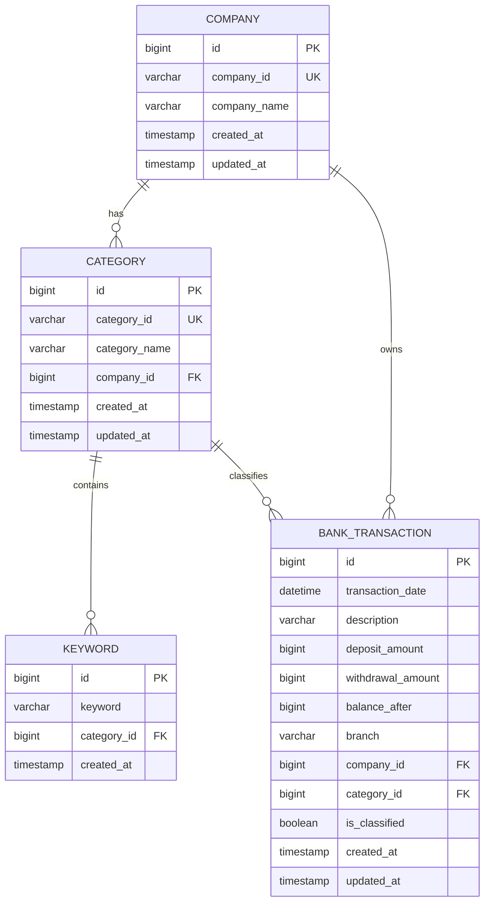

# 자동 회계 처리 시스템

Java 21 + Spring Boot 3.4.7 + MySQL 기반의 자동 회계 처리 시스템입니다.
은행 거래 내역을 분류 규칙에 따라 자동으로 분류하여 회계 처리하는 기능을 제공합니다.

## 🏗️ 시스템 아키텍처

### 기술 스택 선택 이유

**Java 21 + Spring Boot 3.4.7 + MySQL**을 선택한 이유는 **안정적인 생태계와 높은 생산성** 때문입니다. 유지보수가 용이하고, 풍부한 커뮤니티 지원으로 빠르게 문제를 해결할 수 있으며, 개발자 수급 또한 쉬워 사업 확장에 유리합니다.

**Kotlin 호환성**: 현재 Java 코드는 **Kotlin으로 완전 호환 변환이 가능**합니다. Kotlin의 간결한 문법, null 안전성, 함수형 프로그래밍 지원으로 코드 품질 향상과 개발 생산성 증대가 가능하며, Spring Boot와의 완벽한 호환성으로 기존 Java 기반 팀도 점진적 도입이 가능합니다.

### A. DB 스키마 설계



**설계 특징:**
- **다중 사업체 지원**: 여러 회사(Company)를 관리할 수 있는 구조
- **유연한 분류 체계**: 각 회사별로 독립적인 계정과목(Category) 관리
- **키워드 기반 분류**: 거래 내역의 적요(description)를 키워드로 매칭하여 자동 분류
- **분류 상태 추적**: `is_classified` 필드로 분류 완료 여부 관리
- **데이터 무결성**: 외래키 제약조건으로 데이터 일관성 보장

### B. 애플리케이션 레이어 구조

```
src/main/java/com/accounting/
├── entity/           # JPA 엔티티
├── dto/             # 데이터 전송 객체
├── repository/      # 데이터 액세스 레이어
├── service/         # 비즈니스 로직 레이어
├── controller/      # REST API 컨트롤러
└── config/          # 설정 클래스
```

## 🔧 핵심 자동 분류 로직

### 현재 구현된 분류 알고리즘

**1단계: 규칙 파일 로딩 및 캐시 생성**
```java
// JSON 규칙을 키워드 매핑 캐시로 변환
Map<String, CategoryInfo> keywordToCategory = buildKeywordCache(rules);
```

**2단계: 키워드 매칭을 통한 분류**
```java
// 거래 적요에서 키워드 검색 - 가장 긴 키워드 우선 선택
private CategoryInfo classifyTransaction(String description, Map<String, CategoryInfo> keywordToCategory) {
    String lowerDescription = description.toLowerCase();

    return keywordToCategory.entrySet().stream()
            .filter(entry -> lowerDescription.contains(entry.getKey()))
            .max(Comparator.comparing(entry -> entry.getKey().length()))  // 긴 키워드 우선
            .map(Map.Entry::getValue)
            .orElse(null);
}
```

**3단계: 분류 결과 적용 및 저장**
- 매칭된 키워드의 회사(Company) 및 계정과목(Category) 정보로 거래 내역 분류
- `is_classified = true` 설정하여 분류 완료 상태 관리

### 고도화 확장 방안

**규칙이 복잡해질 경우의 확장 아이디어:**

**1. 금액 구간 조건 추가**
```java
// 확장된 규칙 구조
public class AdvancedCategoryRule {
    private String categoryId;
    private String categoryName;
    private List<String> keywords;
    private AmountRange amountRange;        // 신규: 금액 조건
    private List<String> excludeKeywords;   // 신규: 제외 키워드
    private TimeRange timeRange;            // 신규: 시간 조건
}

// 고급 분류 로직
private CategoryInfo advancedClassifyTransaction(BankTransaction transaction, List<AdvancedCategoryRule> rules) {
    return rules.stream()
            .filter(rule -> matchesKeywords(transaction.getDescription(), rule.getKeywords()))
            .filter(rule -> matchesAmountRange(transaction.getAmount(), rule.getAmountRange()))
            .filter(rule -> !matchesExcludeKeywords(transaction.getDescription(), rule.getExcludeKeywords()))
            .filter(rule -> matchesTimeRange(transaction.getTransactionDate(), rule.getTimeRange()))
            .findFirst()
            .map(rule -> new CategoryInfo(rule.getCompanyId(), rule.getCategoryId()))
            .orElse(null);
}
```

**2. 우선순위 기반 규칙 엔진**

점수 기반 매칭으로 복잡한 분류 조건을 지원하는 고급 규칙 엔진:

```java
// 규칙 우선순위 및 점수 기반 매칭
public class RuleEngine {
    private static final double THRESHOLD = 0.7;
    
    public CategoryInfo classify(BankTransaction transaction) {
        return rules.stream()
            .map(rule -> new RuleMatch(rule, calculateScore(transaction, rule)))
            .filter(match -> match.getScore() > THRESHOLD)
            .max(Comparator.comparing(RuleMatch::getScore))
            .map(match -> match.getRule().getCategoryInfo())
            .orElse(null);
    }
    
    private double calculateScore(BankTransaction transaction, Rule rule) {
        double keywordScore = matchKeywords(transaction.getDescription(), rule.getKeywords());
        double amountScore = matchAmountRange(transaction.getAmount(), rule.getAmountRange());
        return (keywordScore * 0.7) + (amountScore * 0.3);
    }
}
```

## 🚀 주요 기능

### 1. 자동 회계 처리 API
`POST /api/v1/accounting/process`

**입력**: CSV 거래 내역 + JSON 분류 규칙 파일  
**출력**: 처리 결과 통계 (총 건수, 분류 완료 건수, 미분류 건수)

### 2. 분류 결과 조회 API
`GET /api/v1/accounting/records?companyId={companyId}`

**기능**: 특정 사업체의 분류된 거래 내역 조회 (페이징 지원)  
**출력**: 거래 내역 + 분류 정보 (회사명, 계정과목명 포함)

### 3. 통계 조회 API
`GET /api/v1/accounting/statistics/{companyId}`

**기능**: 회사별 분류 통계 정보 제공  
**출력**: 총 거래 건수, 분류 완료 건수, 분류율 등

### 4. 회사 목록 조회 API
`GET /api/v1/accounting/companies`

**기능**: 등록된 모든 회사 정보와 계정과목 조회

### 5. 미분류 거래 조회 API
`GET /api/v1/accounting/unclassified`

**기능**: 분류되지 않은 거래 내역 조회

## 🛠️ 기술 스택

| 구분 | 기술 | 버전 |
|------|------|------|
| **언어** | Java | 21 |
| **프레임워크** | Spring Boot | 3.4.7 |
| **데이터 액세스** | Spring Data JPA | - |
| **데이터베이스** | MySQL | 8.0+ |
| **빌드 도구** | Gradle (Kotlin DSL) | 8.0+ |
| **파일 처리** | Apache Commons CSV | - |
| **JSON 처리** | Jackson | - |
| **코드 간소화** | Lombok | - |

## 📋 설치 및 실행

### 사전 요구사항
- Java 21, MySQL 8.0+, Gradle 8.0+

### 3. 스키마 생성
```bash
mysql -u accounting_user -p accounting_db < schema.sql
```


## 📝 API 사용 예시

### 자동 회계 처리
```bash
curl -X POST http://localhost:8080/api/v1/accounting/process \
  -F "transactionsFile=@bank_transactions.csv" \
  -F "rulesFile=@rules.json"
```

**응답 예시:**
```json
{
  "totalTransactions": 9,
  "classifiedTransactions": 7,
  "unclassifiedTransactions": 2,
  "message": "Processing completed. 7/9 transactions classified."
}
```

### 분류 결과 조회
```bash
curl "http://localhost:8080/api/v1/accounting/records?companyId=com_1&page=0&size=10"
```

**응답 예시:**
```json
{
  "content": [
    {
      "id": 1,
      "transactionDate": "2024-01-15 10:30:00",
      "description": "네이버페이 결제",
      "depositAmount": 150000,
      "withdrawalAmount": 0,
      "balanceAfter": 1500000,
      "branch": "강남점",
      "companyId": "com_1",
      "companyName": "A 커머스",
      "categoryId": "cat_101",
      "categoryName": "매출",
      "isClassified": true
    }
  ],
  "pageable": {
    "pageNumber": 0,
    "pageSize": 10
  },
  "totalElements": 5,
  "totalPages": 1
}
```

## 🛡️ 보안 강화 방안

실제 서비스에서 **은행 거래 내역, 공인인증서** 등 민감한 정보를 다루는 보안 시스템 구축 방안:

### 저장 방식
- **공인인증서**: 원본 파일을 서버에 직접 저장하지 않고 **AES-256 암호화**하여 AWS S3 등 안전한 스토리지에 보관
- **비밀번호**: 절대로 평문 저장하지 않고 **BCrypt, Argon2** 등 단방향 해시 알고리즘으로 해싱 후 MySQL에 저장

### 암호화
- **파일 암호화**: 공인인증서 파일은 **AES-256 대칭키 암호화** 적용
- **전송 암호화**: 모든 데이터 송수신은 **TLS(HTTPS)** 통해 암호화 전송

### 키 관리
- **중앙화된 키 관리**: **AWS KMS** 또는 **HashiCorp Vault** 활용한 암호화 키 중앙 관리
- **키 로테이션**: 암호화 키를 **주기적으로 로테이션**하여 보안성 강화

### 접근 제어
- **역할 기반 접근 제어**: **Spring Security RBAC** 구축으로 인증서 접근 엄격 제한
- **다중 인증**: 공인인증서 접근 시 **MFA(다중 인증)** 필수 요구
- **접근 로깅**: 모든 접근 및 사용 로그 기록으로 **실시간 이상행위 탐지**

```java
// 보안 구현 예시
@PreAuthorize("hasRole('CERTIFICATE_ADMIN') and hasPermission(#companyId, 'CERTIFICATE_ACCESS')")
@PostMapping("/certificate/access")
public ResponseEntity<?> accessCertificate(@RequestParam String companyId,
                                           @RequestParam String mfaCode) {
    // MFA 검증 후 암호화된 인증서 접근
}
```

## 🚨 문제상황 해결책

**시나리오**: 한 고객사의 거래 데이터가 다른 고객사 대시보드에 노출된 보안 사고 발생

### 즉시 대응 조치
- **기능 긴급 중지**: 해당 **대시보드 기능을 즉시 중단**하여 추가 노출 방지
- **피해 범위 특정**: 유출된 데이터 범위 및 **피해 고객사를 신속히 특정**
- **고객 안내**: 양측 고객사에 **즉각적인 안내 및 사과 연락** 진행
- **비상대응팀 구성**: 보안 담당자 및 개발팀 중심 **비상대응팀을 즉시 구성**

### 원인 분석 방법
- **접근 로그 추적**: **Spring Security 로그 및 데이터 접근 로그**를 통해 잘못된 권한 처리 지점 파악
- **DB 접근 이력 분석**: 데이터베이스 접근 이력과 **대시보드 API 호출 로그 추적**으로 잘못된 파라미터 전달 확인
- **코드 긴급 디버깅**: **비즈니스 로직 내 고객 데이터 필터링 처리** 부분의 결함 식별

### 재발 방지 대책
- **권한 관리 강화**: **고객별 데이터 접근 권한을 명확히 분리**하고 접근 조건 엄격 검증
- **접근 제어 정책 강화**: **Spring Security 기반 고객 간 데이터 접근 원천 차단** 로직 구현
- **테스트 체계 강화**: 고객 데이터 조회/노출 시 **Unit Test, Integration Test 추가 구축**으로 배포 전 철저 점검
- **비상 대응 체계 정비**: **비상 대응 매뉴얼 정비** 및 주기적 모의 훈련으로 사고 대응 능력 향상

```java
// 재발 방지를 위한 보안 강화 예시
@PreAuthorize("hasPermission(#companyId, 'COMPANY_DATA_ACCESS')")
@GetMapping("/records")
public ResponseEntity<Page<AccountingRecordDto>> getAccountingRecords(
        @RequestParam String companyId,
        Authentication auth) {

    // 추가 보안 검증: 현재 사용자가 해당 회사 데이터에 접근 권한이 있는지 확인
    if (!securityService.hasCompanyAccess(auth.getName(), companyId)) {
        throw new AccessDeniedException("Company data access denied");
    }

    return ResponseEntity.ok(accountingService.getAccountingRecords(companyId, pageable));
}
```

## 🚀 실행 및 테스트 가이드

### 프로젝트 설정 및 실행

**Docker**가 사전에 설치되어 있어야합니다.

**Docker Compose 자동 연동**으로 MySQL 설정 없이 즉시 실행 가능합니다.

**Docker Compose 의존성** 추가로 `compose.yaml`을 활용하여 **MySQL 자동 연동**됩니다. 별도 데이터베이스 설치 불필요!

### API 테스트 방법

#### IntelliJ IDEA
1. **프로젝트 열기**: IDE에서 `accounting` 폴더 오픈
2. **HTTP 테스트**: `http/accounting.http` 파일 열기
3. **테스트 실행**: 각 요청 옆 ▶️ 버튼 클릭하여 순차 테스트

#### postman 사용자
1. postman_collection.json을 import해줍니다.
2. 자동 회계 처리 부분은 text로 되어있습니다. (file로 변경 후 업로드 가능합니다.)


## 🤖 AI 활용 개발 과정

### AI 도구 활용
**Claude를 통해 전체 시스템을 구현**하였으며, 실제 운영 환경에서 발생할 수 있는 문제들을 AI와의 협업을 통해 해결했습니다.

### 주요 개선 사항

**1. 스키마 안정성 강화**
- **기존**: `CREATE TABLE company`
- **개선**: `CREATE TABLE IF NOT EXISTS company`
- **효과**: 애플리케이션 재시작 시 테이블 중복 생성 오류 방지

**2. 인덱스 관리 최적화**
- **기존**: 별도 `CREATE INDEX` 구문
- **개선**: `CREATE TABLE` 내부에 인덱스 정의 통합
- **효과**: 인덱스 중복 생성으로 인한 SQL 오류 방지

### 개발 프로세스
1. **AI 기반 초기 설계**: Claude를 통한 전체 아키텍처 및 코드 구현
2. **실행 기반 검증**: 실제 애플리케이션 실행 후 발생하는 오류 로그 분석
3. **반복적 개선**: 오류 로그를 바탕으로 AI와 협업하여 코드 수정
4. **안정성 확보**: 실운영 환경을 고려한 예외 상황 처리 강화

이러한 **AI-Human 협업 방식**을 통해 이론적 설계와 실제 운영 환경 간의 간극을 효과적으로 해결할 수 있었습니다.

### 프로젝트 구조 구현
back_transactions.csv, rules.json파일 제공 후 prompt를 아래와 같이 작성하였습니다.
```
## 기술스택
Java 21, Spring Boot 3.4.7, MySQL

1. Spring Web, Spring Data JPA 기반으로 구성하고, MySQL을 가정해주세요.
2. 주요 도메인 Entity, DTO, Repository, Service, Controller 레이어를 구성하고, 함수 시그니처 작성 후 로직 작성해주세요.
3. 프로젝트는 Gradle 기반이며, Kotlin DSL을 사용하는 build.gradle.kts 예시도 포함해주세요.
4. ERD를 기반으로 한 schema.sql도 함께 구성해주세요.

## 제공내용
1. 핵심 로직 구현 코드 (GitHub Repository)
   기능 1: 자동 회계 처리 API (POST /api/v1/accounting/process)
   bank_transactions.csv 파일과 rules.json 파일을 입력받아, 규칙에 따라 각 거래 내역을 해당하는 회사와 계정과목으로 자동 분류하여 DB에 저장하는 기능을 구현합니다.

기능 2: 사업체별 분류 결과 조회 API (GET /api/v1/accounting/records?companyId=...)
companyId (e.g., com_1)를 파라미터로 받아, 해당 사업체에 귀속된 거래 내역과 분류된 계정과목 정보(category_id, category_name)를 함께 반환합니다.
어떤 규칙과도 일치하지 않는 거래 내역은 특정 회사에 귀속시키지 않거나, '미분류' 항목으로 처리해야 합니다.

2. 설계 및 보안 아키텍처 기술서 (README.md 또는 별도 문서)

A. 시스템 아키텍처
DB 스키마: 여러 사업체를 지원하고, 거래 내역과 분류 결과를 저장할 수 있는 유연한 DB 구조를 설계해 주세요. (SQL CREATE TABLE 구문 또는 ERD)

B. 핵심 자동 분류 로직
rules.json을 기반으로 거래 내역을 자동 분류하는 로직의 동작 방식을 설명해 주세요.

제공한 내용을 참고해서 신규 프로젝트를 생성해주세요.
```

#### 이론적으로 이상적으로 작성했으나 실제로 한번도 경험해보지 않은 부분이 있다면 작성해주세요.
C. 보안 강화 방안부분은 검색 및 자료를 토대로 작성하였으며 공인인증서 정도의 민감한 정보를 다루며 실무를 경험해본적은 없습니다.
